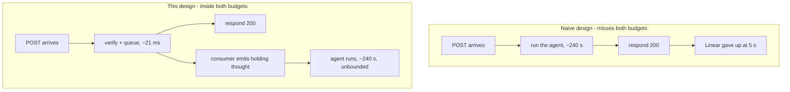
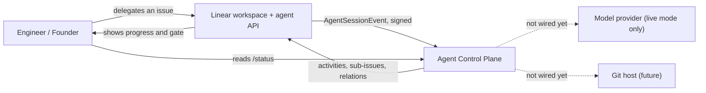
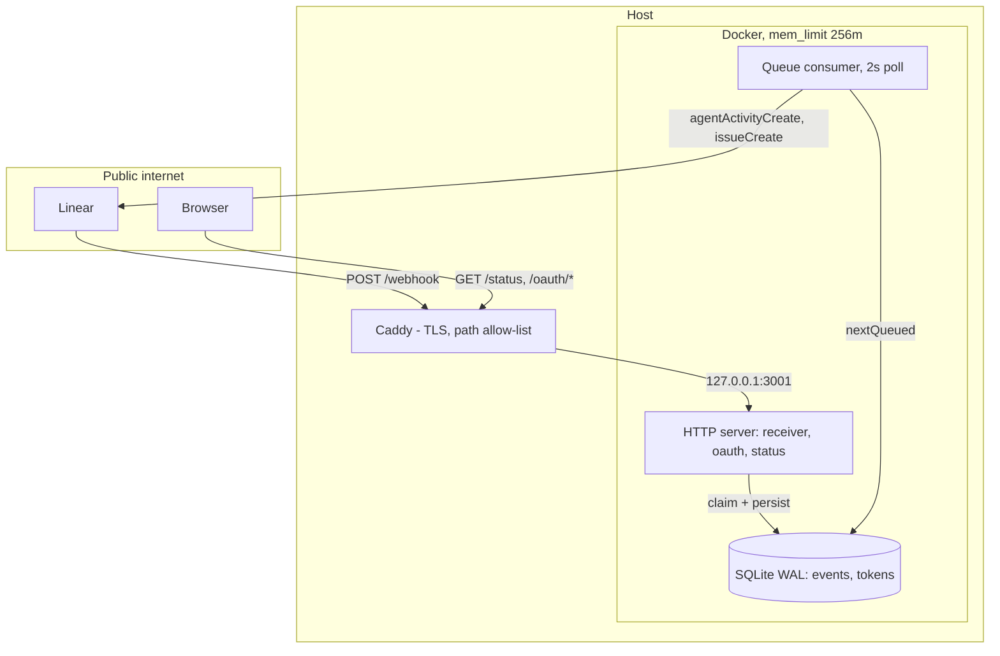
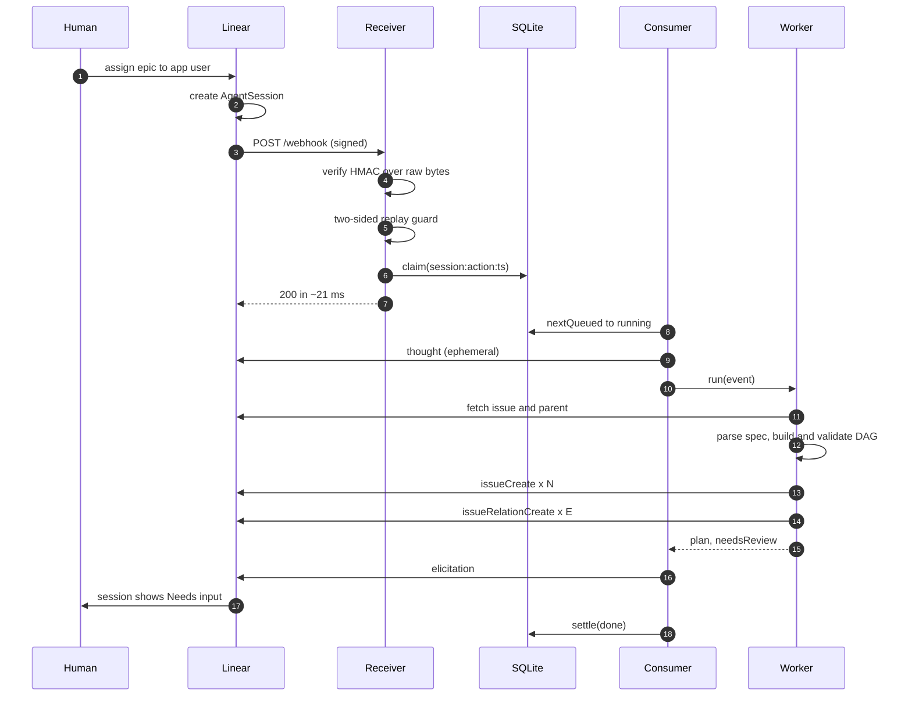
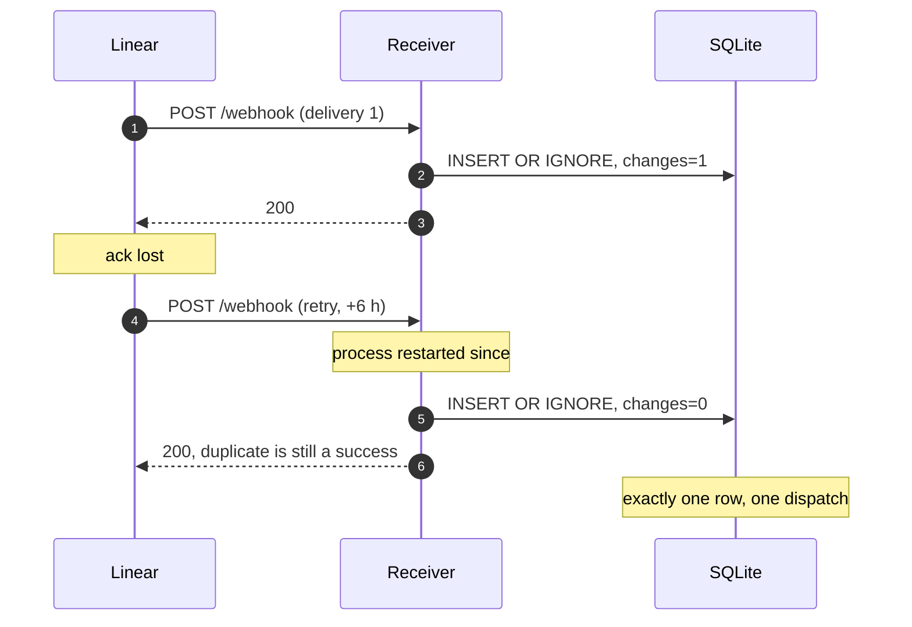
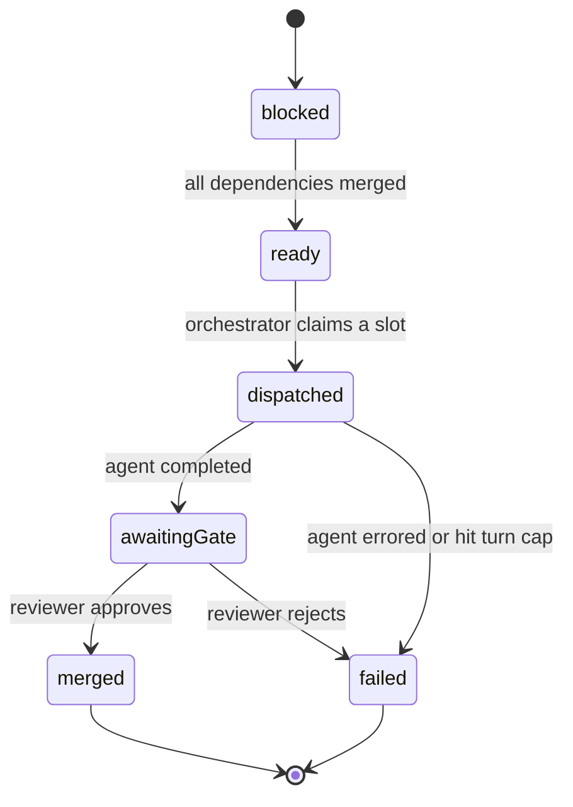
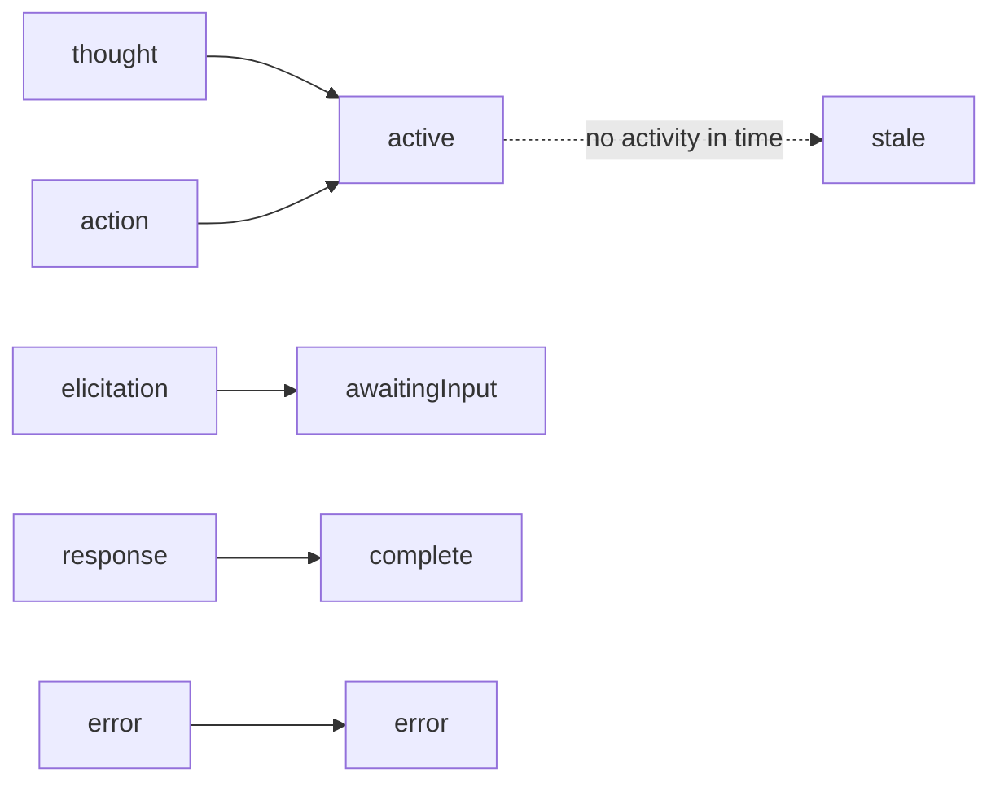
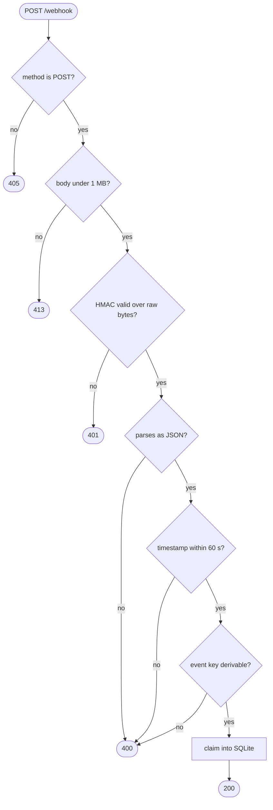
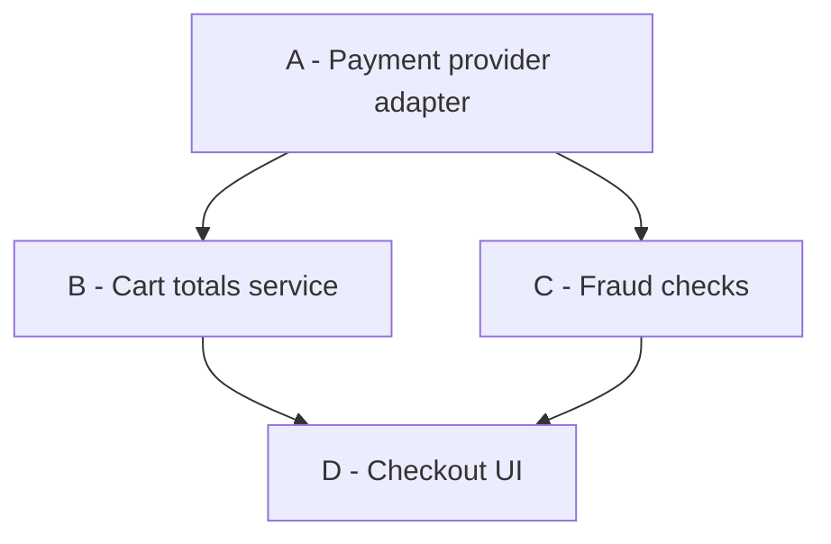
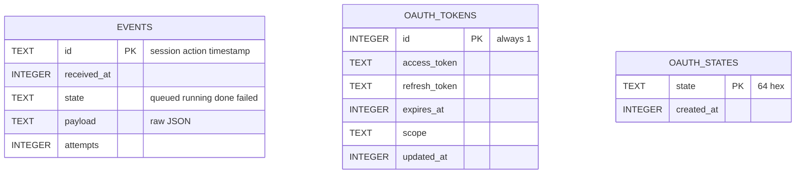

# Design document

Architecture, high-level and low-level design for the Agent Control Plane.

Companion documents: [README](../README.md) for what it does, [RUNBOOK](../RUNBOOK.md) for
operating it.

---

## 1. Problem statement

Teams running AI coding agents need a control plane: somewhere intent is recorded, work is
dispatched, humans review before anything merges, and an audit trail accumulates. Building a
bespoke UI for that is wasted effort when an issue tracker already does most of it.

This system makes **Linear** that control plane. A human delegates an issue to an app user;
the system decomposes it into dependency-ordered work packages, creates them as real
sub-issues with `blocks` relations, and stops at a human review gate expressed in Linear's
own session states.

### Requirements

| # | Functional | Status |
|---|---|---|
| F1 | Workspace structure holding work packages and their dependencies | Built |
| F2 | Agent side: app-user, webhook subscriptions, delegation, idempotency | Built |
| F3 | Human review gate with SLA and escalation, using stock Linear | Partial — see §9 |
| F4 | Notification routing across several humans in different roles | Partial — see §9 |
| F5 | Founder-readable progress without asking an engineer | Built |
| F6 | A runbook the team owns afterwards | Built |

| # | Non-functional | Where it is met |
|---|---|---|
| N1 | Webhook handler returns inside **5 s** | `receiver.ts` — ack-then-queue, p99 13.1 ms |
| N2 | Session shows an activity inside **10 s** | `consumer.ts` — holding `thought` before the worker |
| N3 | A duplicate delivery never dispatches twice | `store.ts` — durable dedupe, composite key |
| N4 | State survives process restarts | SQLite WAL; no in-memory queues |
| N5 | A clone runs without paying anyone | `MODE=replay`; free Linear plan; no API key |
| N6 | Model spend bounded, never unbounded | concurrency, turn cap, spend ceiling |
| N7 | Only intended paths reachable from the internet | Caddy allow-list |

---

## 2. The governing constraint

Everything structural follows from two numbers in Linear's agent documentation.

| Rule | Budget | Consequence of missing it |
|---|---|---|
| Webhook receiver must return | **5 s** | Linear retries, then may disable the webhook |
| A `created` session must show an activity | **10 s** | Session marked unresponsive |
| Retry schedule | 1 min · 1 h · 6 h | Three attempts, then the delivery is abandoned |

A coding agent takes **minutes**. Those facts are irreconcilable in one request, and that
irreconcilability *is* the architecture.



It forces four properties that are not optional:

1. **Ack-then-queue.** The handler verifies, persists, responds. It never awaits a model call
   or a Linear mutation.
2. **A holding activity emitted before the work**, not after — otherwise the 10 s budget is
   blown on every session.
3. **Durable idempotency**, because the third retry lands *six hours* later, by which time a
   deploy has cycled the process.
4. **Durable state**, because agents write concurrently and a lost update is silent.

---

## 3. Architecture

### 3.1 System context



Dotted edges are deliberately unbuilt. Linear is both the input and output surface — there
is no second UI to maintain.

### 3.2 Container view



The HTTP server and the consumer share a process but never share a call stack. The queue is
the seam that keeps the handler inside its budget.

### 3.3 Module map

```mermaid
flowchart TB
    main["main.ts"] --> app["app.ts"]
    main --> cons["consumer.ts"]
    app --> recv["receiver.ts"]
    app --> oauth["oauth.ts"]
    app --> stat["status.ts"]
    recv --> ver["verify.ts"]
    recv --> store["store.ts"]
    oauth --> tok["tokens.ts"]
    cons --> store
    cons --> act["activity.ts"]
    cons --> work["worker.ts"]
    work --> dec["decompose.ts"]
    work --> graph["graph.ts"]
    work --> lin["linear.ts"]
    act --> lin
    graph --> gate["gate.ts"]
    gate --> orch["orchestrator.ts"]
    stat --> store
```

`graph`, `gate`, `orchestrator` and `decompose` form a **pure core with no I/O**. That is why
they are exhaustively testable offline, and why most of this system needs no model.

---

## 4. High-level design

### 4.1 Delegating an epic



Steps 3–7 are the entire content of the webhook handler. Everything from step 8 runs on the
consumer, unbounded in time.

### 4.2 Duplicate delivery



The six-hour retry is why dedupe is on disk. An in-process `Set` passes every fast
redelivery test and then fails here, silently, in production.

### 4.3 Work package lifecycle



`merged` is the only transition that recomputes the ready set. `failed` leaves dependents
blocked on purpose. Completed work never merges itself — it always opens a human gate first.

### 4.4 Activities and derived session state



Session state is **derived** from the latest activity and is never set directly. This is why
`elicitation` is load-bearing: it is the only route to `awaitingInput`, and `awaitingInput`
*is* the review gate. Emitting `response` instead marks the session complete and silently
skips review.

---

## 5. Low-level design

### `verify.ts` — signature and replay

HMAC-SHA256 over **raw request bytes**, compared with `timingSafeEqual`.

- **Length is checked before the constant-time compare.** `timingSafeEqual` throws on a
  length mismatch, and that exception path is itself an information leak.
- **The replay guard is two-sided.** A timestamp far in the *future* is as suspect as a stale
  one; the common one-sided `now - ts < tolerance` check accepts it silently.

> Never verify re-stringified JSON. The hazard is **not** key ordering —
> `JSON.stringify(JSON.parse(x))` preserves string-key insertion order, so a key-order
> example passes by accident and teaches the wrong lesson. The real hazards are whitespace
> and number formatting: `{"a": 1.0}` round-trips to `{"a":1}` and the HMAC breaks.

### `store.ts` — durable dedupe and queue

One SQLite table doing double duty as an idempotency ledger and a work queue. `claim()` uses
`INSERT OR IGNORE` and reads `changes` to distinguish first delivery from duplicate — one
atomic statement, no read-then-write race.

`requeueStale()` returns `running` rows older than a threshold to `queued`. Without it, a
consumer killed mid-run strands its event forever and the Linear session ages to `stale` with
no explanation anywhere.

### `receiver.ts` — the handler that does almost nothing



**Identity choice.** The dedupe key is `session:action:webhookTimestamp`, not the delivery id.
Linear's `webhookId` identifies the webhook *configuration*, and a retry of the same logical
event carries a *new* delivery id — precisely the case dedupe must catch. Keying on delivery
id would deduplicate nothing.

### `consumer.ts` — ordering is the point

Claims one row, emits the holding `thought`, **then** calls the worker. Reversing those two
lines silently blows the 10 s budget on every session, and nothing in the logs would say so.
A test runs a 240-second worker and asserts the first activity still landed inside 10 s.

Failure handling settles rather than strands: an unparseable payload, a missing session id, a
thrown worker, or a throwing emitter all mark the row `failed` instead of leaving it
`running`.

### `graph.ts` — the DAG

Cycle detection is an **iterative** three-colour DFS with an explicit stack; a 5,000-deep
chain must not blow the call stack, and there is a test at exactly that depth. Edges are
validated before the cycle walk so a typo reports as a typo rather than as a confusing
traversal result.

`ready()` is recomputed only on `merge()`. Dispatch claims a package **synchronously**,
moving it out of `ready` before any `await`, which makes double-dispatch impossible between
two concurrent pollers.

### `gate.ts` — review, SLA, escalation

Opening a gate notifies **reviewers only**. Leads and founders are reached solely on SLA
breach — otherwise every gate pages everyone and the signal dies.

Escalation **latches** on `escalatedAt`. Without the latch, every sweep past the deadline
re-notifies, recreating exactly the drowning the design exists to prevent.

### `orchestrator.ts` — bounded dispatch

Three caps: max concurrent agents, max turns per package, and a spend ceiling that halts
dispatch. The ceiling is checked *after* accounting, so a package already in flight when the
limit is crossed cannot overshoot silently. `drain()` is bounded rather than `while(true)` so
a scheduling bug fails loudly instead of hanging CI.

### `decompose.ts` — a parser, not a planner

Reads a `## Work packages` block from the issue description:

```markdown
## Work packages
- [A] Payment provider adapter
- [B] Cart totals service (depends: A)
- [C] Fraud checks (depends: A)
- [D] Checkout UI (depends: B, C)
```



This is the honest boundary: decomposition is the one part that genuinely needs a model, so
replay mode reads a spec a human wrote rather than inventing one. The `Worker` type is the
seam — swapping in a model changes one function and nothing else.

### `worker.ts` — epic or leaf

Branches on whether the delegated issue **has a parent**. No parent means an epic to
decompose; a parent means it *is* a work package and is worked directly. Using parent
presence avoids inventing a label or custom field a human could set inconsistently.

The graph is built and validated **before** anything is written to Linear, so a cycle fails
as a parse error rather than as four orphaned sub-issues someone cleans up by hand.

### `oauth.ts` / `tokens.ts` — installing as an app user

`actor=app` is the parameter the whole integration depends on. Without it the token acts as
whoever clicked authorize rather than as the app, and the app never becomes assignable.

Scopes are **pinned in code**, not configurable: `read`, `write`, `app:assignable`,
`app:mentionable`. A missing `app:assignable` installs cleanly and then delivers **zero**
events — a silent failure that should not be reachable through configuration.

OAuth state is 32 CSPRNG bytes, single-use, 10-minute TTL, stored **on disk** — the callback
can arrive after a restart, and an in-memory map turns that into a spurious CSRF rejection.
It is burned on presentation whether or not it validates.

### `linear.ts` — GraphQL client

> **Trap:** GraphQL errors arrive with **HTTP 200**. Checking `res.ok` alone proves nothing;
> the `errors` array must be inspected on every call.

### `status.ts` — founder-readable progress

Plain server-rendered HTML: no build step, no JavaScript, readable on a phone, and it still
works when the thing it reports on is broken — exactly when a non-technical reader goes
looking. Shows issue keys rather than session UUIDs, and escapes all payload-derived text;
a test asserts a script tag cannot be injected through an issue identifier.

---

## 6. Data model



Three tables, one file, WAL mode. `oauth_tokens` is constrained to a single row
(`CHECK id = 1`) — one workspace, one installation; re-installing replaces rather than
accumulates.

---

## 7. Security design

| Surface | Control |
|---|---|
| Inbound webhooks | HMAC-SHA256 over raw bytes, constant-time compare, two-sided replay guard, 1 MB body cap |
| Exposed paths | Caddy allow-lists four paths; all else 404s before reaching Node |
| OAuth | Single-use durable state, 10-minute TTL, CSRF checked *before* the code is spent |
| Secrets | `.env` chmod 600 outside the repo, never committed; token-exchange error bodies never rendered |
| Blast radius | Container `mem_limit 256m` so this stack dies alone |
| Output | All payload-derived text HTML-escaped on the status page |

---

## 8. Testing strategy

**87 tests, no network, no API keys, no model calls.** Runs on `node:test` with zero test
dependencies.

The tests worth naming are the ones encoding a failure that would otherwise be invisible:

| Test | What it prevents |
|---|---|
| Dedupe survives a process restart | The six-hour retry double-dispatching after a deploy |
| 240-second worker vs the 10 s budget | Emitting the holding activity after the work |
| Handler p99 over 200 sequential deliveries | Silent latency creep toward the 5 s cliff |
| Re-stringified JSON fails verification | Verifying a parsed body instead of raw bytes |
| Escalation fires once across many sweeps | Re-paging four humans on every timer tick |
| 5,000-deep dependency chain | Stack overflow from recursive cycle detection |
| Script tag through an issue identifier | XSS on the status page |
| Consumer killed mid-run recovers | A stranded row leaving the session at "Working…" |

**Not covered by tests:** `LinearEmitter` and `LinearClient` are thin adapters over the live
API. They were verified by running against a real workspace, not by tests.

---

## 9. Known gaps

Also stated in the [README](../README.md) and [RUNBOOK](../RUNBOOK.md).

### Gap 1 — the orchestrator is not driven by real Linear transitions

The most significant one. `graph.ts`, `gate.ts` and `orchestrator.ts` are correct and tested,
but exercised by tests rather than by Linear. **Approving a gate in Linear does not unblock
dependents.** The graph lives in memory during one decomposition and is then discarded.

*To close it:* persist the graph alongside issue ids, subscribe to issue-state webhooks, and
map Linear transitions onto `merge()` and `fail()`.

### ~~Gap 2 — no OAuth token refresh~~ — CLOSED

Access tokens last 24 hours. `TokenRefresher` (`src/refresh.ts`) is ticked once a minute by
the service loop and renews the token inside `isExpired()`'s 60-second skew, so a call never
starts on a live token and lands on a dead one.

The token is consumed through a *synchronous* getter — `() => tokens.getToken()?.accessToken`
is handed to `LinearClient` and `LinearEmitter` at construction — so refreshing could not
happen lazily at the call site without making that getter async and rippling through both
clients, their constructors and their tests. Refreshing ahead of time on a timer keeps every
consumer untouched.

Three behaviours are worth naming because each is a bug that would otherwise appear a day
late and look unrelated to its cause:

- **The refresh token is carried forward when the response omits one.** Linear does not
  guarantee a rotated refresh token; storing `undefined` would convert a recoverable 24-hour
  expiry into a permanent uninstall on the *following* day.
- **A rejected grant (400/401) clears the install; a 5xx or dropped socket does not.** The
  first is Linear saying the credential is dead, and keeping the row would make `/healthz`
  answer `installed:true` while every API call 401s. The second is a transient outage, where
  discarding a still-usable token would be self-inflicted damage. Failures back off
  exponentially (60s doubling to a 15-minute cap) rather than retrying every tick.
- **Concurrent ticks cannot both refresh.** `oauth_tokens` is a single-row table, so two
  racing writers could persist a token the winner had already superseded.

### Gap 3 — `live` mode does not exist

`MODE=live` is read and reported but there is no model in the loop. The caps, fixtures and
`Worker` seam are in place for it.

### Beyond the three

- **Real pull requests** — a git host adapter so a package produces a branch and a PR, and
  the gate reviews a diff rather than a description.
- **Notification transport** — routing exists in code; Slack or email delivery does not.
- **Scheduled SLA sweeps** — `ReviewGate.sweep()` is tested but nothing calls it on a timer.
- **Multi-workspace** — the single-row token table is a deliberate one-workspace assumption.

---

## 10. Alternatives considered

**Why not process the work inside the webhook handler?**
A coding agent takes minutes; the budget is five seconds. No amount of optimisation closes a
48× gap. The queue is not an optimisation — it is the only correct shape.

**Why SQLite rather than Postgres, Redis or SQS?**
The requirement was that a clone runs with no paid dependency and no external service. WAL
mode gives durability, atomic `INSERT OR IGNORE` for idempotency, and restart survival.
*When it breaks:* a single writer on a single host. Horizontal scale, or a consumer separate
from the receiver, needs Postgres with `SELECT … FOR UPDATE SKIP LOCKED`, or a real broker.
The `EventStore` interface is the seam where that swap happens.

**Why poll every 2 s rather than dispatch in-process on receipt?**
Polling survives restarts for free: whatever is `queued` is picked up on boot with no recovery
logic. Dispatching in-process would couple the handler's lifetime to the work — the thing
being avoided. *Cost:* up to 2 s added latency, affordable against a 10 s budget. If it
stopped being affordable the fix is a notify channel, not a shorter poll.

**Why not Temporal, Inngest or a durable-execution framework?**
They solve exactly this class of problem and would be right at scale. Rejected here because
they add an external dependency a client must run, and because the interesting content — the
5 s/10 s reasoning, retry-driven idempotency, gate semantics — would be hidden inside the
framework rather than demonstrated.

**Why `elicitation` rather than a custom Linear workflow state?**
The gate had to be built on stock Linear. A custom state needs configuring in every team and
drifts. `elicitation` drives `awaitingInput`, which is native, needs no configuration, and
reads to a human as "Needs input".

**Why a parser rather than an LLM for decomposition?**
It keeps the demo free, deterministic and reproducible by a stranger, and is honest about
where the intelligence sits.

**Why is the dedupe key composite rather than the delivery id?**
A retry of the same logical event carries a *new* delivery id — the exact case dedupe exists
to catch. Only `session:action:timestamp` is stable across retries.

**Why `node:sqlite` rather than `better-sqlite3`?**
Forced, not chosen: `better-sqlite3` segfaults on Node 22.9 on the build host, including
rebuilt from source.

**Why one process rather than separate services?**
Operational simplicity at this scale; the queue already provides the decoupling that matters.
The split point is pre-decided — the consumer reads only through `EventStore`.

---

## 11. References

- [Linear — Agents](https://linear.app/developers/agents)
- [Linear — Agent interaction model](https://linear.app/developers/agent-interaction)
- [Linear — OAuth actor authorization](https://linear.app/developers/oauth-actor-authorization)
- [Linear — OAuth 2.0 authentication](https://linear.app/developers/oauth-2-0-authentication)
- [Linear — API and webhooks](https://linear.app/docs/api-and-webhooks)
- [linear/linear-agent-demo](https://github.com/linear/linear-agent-demo)
- [SQLite WAL mode](https://www.sqlite.org/wal.html)
- [Node.js `node:sqlite`](https://nodejs.org/api/sqlite.html)
- [Temporal — durable execution](https://docs.temporal.io/)
- [Caddyfile reference](https://caddyserver.com/docs/caddyfile)
